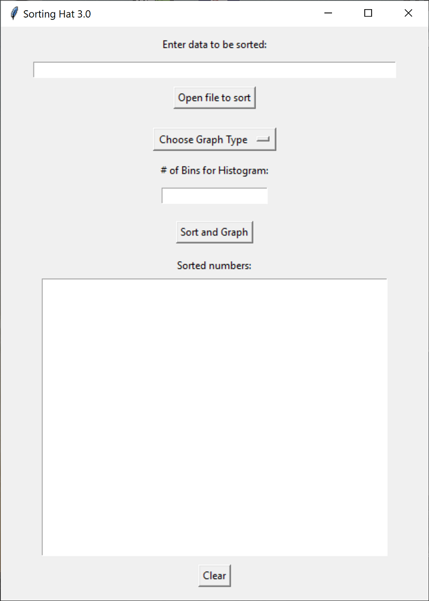

<h1>Sorting Hat 4.0</h1>

<b>Now with the ability to extract and sort both integers and floats.</b>

<a href="https://jrh89.gumroad.com/l/msxuw">Available for download here</a>

<h1>Sorting Hat 3.0</h1>

<b>NOTICE: Sorting Hat 3.0 does not support sorting float values. However, v4.0 is in development and will have the ability to do so.</b>

Sorting Hat 3.0 is a simple but powerful tool for extracting and sorting numbers from any input data. With a simple and user-friendly interface, the GUI allows users to easily extract numbers from data then sort them and also display them on a bar graph, line graph, scatter plot, histogram, or pie chart giving flexibility to choose the best way to visualize the data. Whether you're a researcher, data analyst, or just someone looking to organize numerical information, Sorting Hat 3.0 is an excellent solution for your data sorting needs.

Sorting Hat 3.0 uses the radiX sorting algorithm to efficiently sort large sets of data.

<h2>How To: </h2>

Create a standalone executable that opens the GUI using pyinstaller:

   
Dependencies: python(3.11.2 recommended), matplotlib, pyinstaller

   

   1. Save the python file 
   2. Open terminal of choice 
   3. 'cd' to the directory where SortingHat_3.py was saved 
   4. Run the following command line:  
     
 pyinstaller SortingHat_3.py --onefile --name "Sorting Hat 3.0" -w 

   5. Locate file and double click to open GUI.
   

   

<b>-OR-</b>

Dependencies: python(3.11.2 recommended), matplotlib

   
After installing dependencies, simply save and run SortingHat_3.py to open GUI.

<h3 style="text-align: center">New Features:</h3>

1. Separating and sorting numbers from text.

2. Option to choose between histogram, scatter plot, line graph, bar graph, and pie chart.

3. Custom # of histogram bins (optional, default 10).

