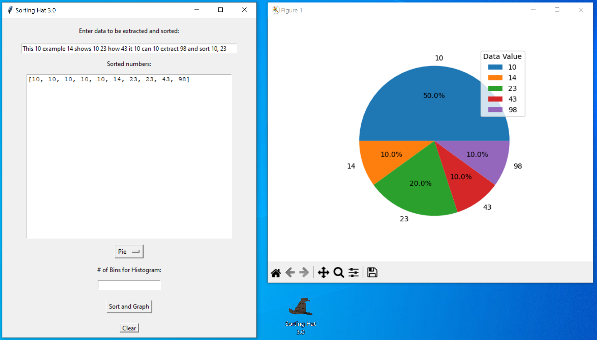

<h1>Sorting Hat 3.0</h1>

Sorting Hat 3.0 is a powerful tool for extracting and sorting numbers from any input data. With a simple and user-friendly interface, the script allows users to easily extract numbers from data then sort them and also display them on a bar graph, line graph, scatter plot, histogram, or pie chart giving flexibility to choose the best way to visualize the data. Whether you're a researcher, data analyst, or just someone looking to organize numerical information, Sorting Hat 3.0 is an excellent solution for your data sorting needs.

Sorting Hat 3.0 uses the radiX sorting algorithm to efficiently sort large sets of data.

<h2>How To: </h2>
 

<a href="https://drive.google.com/file/d/1Gxk6uAqsz7D6W7_r0uVNlCHnNFavWR4m/view?usp=sharing">Download Packaged .exe Here (Google Drive)<a/>

<b>-OR-</b>

Create a standalone executable that opens the GUI-

   
   

   1. Save the python file 
   2. Open terminal of choice 
   3. 'cd' to the directory where SortingHat_3.py was saved 
   4. Run the following command line: pyinstaller SortingHat_3.py --onefile --name "Sorting Hat 3.0" -w
   

    

<h3 style="text-align: center">New Features:</h3>

1. Parsing and sorting numbers from text.

2. Option to choose between histogram, scatter plot, line graph, bar graph, and pie chart depending
      on the users need based on their data sets.

